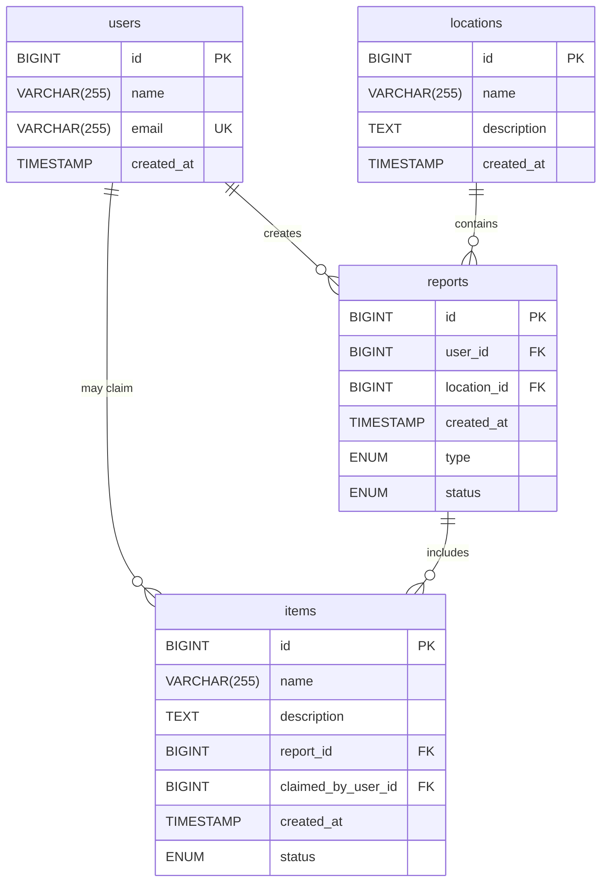

# 📱 Campus Lost & Found Service – Final Implementation

## 🎯 Project Overview

The Campus Lost & Found Service is a mobile-first full-stack application that helps people on our campus report and recover lost and found items. Users (students, faculty, staff) can report items they've found, which creates visible entries for others to browse and retrieve their lost belongings.

---

## 👤 User Stories

### 🟦 User Story #1 – Static Info Page

**Story:**
As an interested user, I want to receive general information about the Lost & Found app, so that I can decide whether or not it is useful.

**Affected/Related Resources:**
_(none)_

**Implementation Status:** ✅ **Completed**
Static homepage with an overview of functionality, benefits, and how to contribute.

---

### 🟩 User Story #2 – View All Items and Reports

**Story:**
As a student looking for something I lost, I want to see all items and reports, so that I can find my lost item.

**Affected/Related Resources:**
`items`, `reports`, `locations`, `users`

**Implementation Status:** ✅ **Completed**

**Implemented Endpoints:**
- List view with filters and search: `GET /api/v1/items`
- Item detail view: `GET /api/v1/items/:id`
- Report detail view (includes item, location and user data): `GET /api/v1/reports/:id`

---

### 🟩 User Story #3 – View Locations and Reports

**Story:**
As a student looking for an item I lost, I want to see all locations and reports, so that I can check if my item is there.

**Affected/Related Resources:**
`locations`, `items`, `reports`, `users`

**Implementation Status:** ✅ **Completed**

**Implemented Endpoints:**
- List view of all locations: `GET /api/v1/locations`
- Location detail view: `GET /api/v1/locations/:id`
- Location items view: `GET /api/v1/locations/:id/items`
- Report detail view (includes item, location and user data): `GET /api/v1/reports/:id`

---

### 🟥 User Story #4 – Report Item

**Story:**
As a student or teacher who has found one or more items, I want to manage reports, so that the owners of the items can retrieve it.

**Affected/Related Resources:**
`reports`, `items`, `locations`, `users`

**Implementation Status:** ✅ **Completed**

**Implemented Endpoints:**
- Form to enter item details and pick location: `POST /api/v1/reports`, `POST /api/v1/items`
- Form to edit report details: `PUT /api/v1/reports/:id`
- Button to delete report: `DELETE /api/v1/reports/:id`
- Form to edit item details: `PUT /api/v1/items/:id`
- Button to delete item: `DELETE /api/v1/items/:id`

---

### 🟥 User Story #5 – Claim Item

**Story:**
As a user who has found their lost item in the app, I want to update the details of the item, so that the report can be closed and the item marked as claimed.

**Affected Resources:**
`reports`, `items`, `users`

**Implementation Status:** ✅ **Completed**

**Implemented Endpoints:**
- Edit report data: `PUT /api/v1/reports/:id`
- Resolve report: `PATCH /api/v1/reports/:id`
- Edit item data (includes marking as claimed): `PUT /api/v1/items/:id`

---

### 🟥 User Story #6 – Manage Locations

**Story:**
As a user who has found an item, I want to manage locations, so that I can add new locations or edit existing ones.

**Affected Resources:**
`locations`

**Implementation Status:** ✅ **Completed**

**Implemented Endpoints:**
- Form to add new location: `POST /api/v1/locations`
- Form to edit location details: `PUT /api/v1/locations/:id`
- Button to delete location: `DELETE /api/v1/locations/:id`

---

## 🚀 API Design

The API follows RESTful principles and is organized around four main resources: Users, Locations, Reports, and Items.

### Base URL
```
http://localhost:8080/api/v1
```

### Authentication
Currently session-based. No authentication headers required for MVP.

### Content Type
All endpoints accept and return `application/json`.

---

### 👥 Users API

| Method | Endpoint | Description | Request Body | Response |
|--------|----------|-------------|--------------|----------|
| `POST` | `/users` | Create a new user | `UserDTO` | `UserDTO` (201) |
| `GET` | `/users/{id}` | Get user by ID | - | `UserDTO` (200) |
| `GET` | `/users/email/{email}` | Get user by email | - | `UserDTO` (200) |
| `PUT` | `/users/{id}` | Update user | `UserDTO` | `UserDTO` (200) |
| `DELETE` | `/users/{id}` | Delete user | - | - (204) |

**UserDTO Structure:**
```json
{
  "id": 1,
  "name": "John Doe",
  "email": "john.doe@example.com",
  "createdAt": "2024-01-01T00:00:00.000Z",
  "reportIds": [1, 2, 3],
  "claimedItemIds": [4, 5]
}
```

---

### 📍 Locations API

| Method | Endpoint | Description | Request Body | Response |
|--------|----------|-------------|--------------|----------|
| `GET` | `/locations` | Get all locations | - | `LocationDTO[]` (200) |
| `GET` | `/locations/{id}` | Get location by ID | - | `LocationDTO` (200) |
| `GET` | `/locations/{id}/items` | Get items at location | - | `ItemDTO[]` (200) |
| `POST` | `/locations` | Create new location | `LocationDTO` | `LocationDTO` (201) |
| `PUT` | `/locations/{id}` | Update location | `LocationDTO` | `LocationDTO` (200) |
| `DELETE` | `/locations/{id}` | Delete location | - | - (204) |

**LocationDTO Structure:**
```json
{
  "id": 1,
  "name": "Library - Ground Floor",
  "description": "Main entrance area of the university library",
  "createdAt": "2024-01-01T00:00:00.000Z",
  "reportIds": [1, 2, 3]
}
```

---

### 📋 Reports API

| Method | Endpoint | Description | Request Body | Response |
|--------|----------|-------------|--------------|----------|
| `GET` | `/reports` | Get all reports | - | `ReportDTO[]` (200) |
| `GET` | `/reports/{id}` | Get report by ID | - | `ReportDTO` (200) |
| `POST` | `/reports` | Create new report | `ReportDTO` | `ReportDTO` (201) |
| `PUT` | `/reports/{id}` | Update report | `ReportDTO` | `ReportDTO` (200) |
| `PATCH` | `/reports/{id}` | Resolve report | - | `ReportDTO` (200) |
| `DELETE` | `/reports/{id}` | Delete report | - | - (204) |

**ReportDTO Structure:**
```json
{
  "id": 1,
  "userId": 1,
  "locationId": 1,
  "createdAt": "2024-01-01T00:00:00.000Z",
  "type": "FOUND",
  "status": "OPEN",
  "itemIds": [1, 2],
  "location": { /* LocationDTO */ },
  "user": { /* UserDTO */ },
  "items": [ /* ItemDTO[] */ ]
}
```

**Report Types:**
- `FOUND` - User found an item
- `LOST` - User lost an item

**Report Status:**
- `OPEN` - Report is active
- `RESOLVED` - Report has been resolved

---

### 🎒 Items API

| Method | Endpoint | Description | Request Body | Response |
|--------|----------|-------------|--------------|----------|
| `GET` | `/items` | Get all items | - | `ItemDTO[]` (200) |
| `GET` | `/items/{id}` | Get item by ID | - | `ItemDTO` (200) |
| `POST` | `/items` | Create new item | `ItemDTO` | `ItemDTO` (201) |
| `PUT` | `/items/{id}` | Update item | `ItemDTO` | `ItemDTO` (200) |
| `DELETE` | `/items/{id}` | Delete item | - | - (204) |

**ItemDTO Structure:**
```json
{
  "id": 1,
  "name": "Black Backpack",
  "description": "Small black backpack with Nike logo",
  "reportId": 1,
  "claimedByUserId": null,
  "createdAt": "2024-01-01T00:00:00.000Z",
  "locationId": 1,
  "locationName": "Library - Ground Floor",
  "status": "UNCLAIMED",
  "reportStatus": "OPEN",
  "reportType": "FOUND",
  "reporterUserId": 1,
  "reporterUserName": "John Doe"
}
```

**Item Status:**
- `UNCLAIMED` - Item has not been claimed
- `CLAIMED` - Item has been claimed by owner

---

### Error Responses

All endpoints return appropriate HTTP status codes:

- `200 OK` - Successful GET/PUT/PATCH
- `201 Created` - Successful POST
- `204 No Content` - Successful DELETE
- `400 Bad Request` - Invalid request data
- `404 Not Found` - Resource not found
- `409 Conflict` - Duplicate email for users
- `500 Internal Server Error` - Server error

Error response format:
```json
{
  "error": "Error message description"
}
```

---

## 🗄️ Database Schema

The database consists of four main entities with clear relationships supporting the lost and found workflow.

### Entity Relationship Diagram



### Detailed Schema

#### users
| Column | Type | Constraints | Description |
|--------|------|-------------|-------------|
| `id` | `BIGINT` | PRIMARY KEY, AUTO_INCREMENT | Unique user identifier |
| `name` | `VARCHAR(255)` | NOT NULL | User's full name |
| `email` | `VARCHAR(255)` | NOT NULL, UNIQUE | User's email address |
| `created_at` | `TIMESTAMP` | DEFAULT CURRENT_TIMESTAMP | Account creation timestamp |

#### locations
| Column | Type | Constraints | Description |
|--------|------|-------------|-------------|
| `id` | `BIGINT` | PRIMARY KEY, AUTO_INCREMENT | Unique location identifier |
| `name` | `VARCHAR(255)` | NOT NULL | Location name |
| `description` | `TEXT` | | Detailed location description |
| `created_at` | `TIMESTAMP` | DEFAULT CURRENT_TIMESTAMP | Location creation timestamp |

#### reports
| Column | Type | Constraints | Description |
|--------|------|-------------|-------------|
| `id` | `BIGINT` | PRIMARY KEY, AUTO_INCREMENT | Unique report identifier |
| `user_id` | `BIGINT` | NOT NULL, FOREIGN KEY | Reference to reporting user |
| `location_id` | `BIGINT` | NOT NULL, FOREIGN KEY | Reference to location |
| `created_at` | `TIMESTAMP` | DEFAULT CURRENT_TIMESTAMP | Report creation timestamp |
| `type` | `ENUM` | NOT NULL | Report type: 'LOST', 'FOUND' |
| `status` | `ENUM` | NOT NULL | Report status: 'OPEN', 'RESOLVED' |

#### items
| Column | Type | Constraints | Description |
|--------|------|-------------|-------------|
| `id` | `BIGINT` | PRIMARY KEY, AUTO_INCREMENT | Unique item identifier |
| `name` | `VARCHAR(255)` | NOT NULL | Item name |
| `description` | `TEXT` | | Detailed item description |
| `report_id` | `BIGINT` | NOT NULL, FOREIGN KEY | Reference to parent report |
| `claimed_by_user_id` | `BIGINT` | FOREIGN KEY | Reference to claiming user (nullable) |
| `created_at` | `TIMESTAMP` | DEFAULT CURRENT_TIMESTAMP | Item creation timestamp |
| `status` | `ENUM` | NOT NULL | Item status: 'UNCLAIMED', 'CLAIMED' |

### Business Rules and Relationships

1. **User Management**
   - Each user has a unique email address
   - Users can create multiple reports
   - Users can claim multiple items

2. **Location Management**
   - Locations are predefined campus areas
   - Multiple reports can reference the same location
   - Locations can be created, updated, and deleted

3. **Report Workflow**
   - Each report is created by exactly one user
   - Each report is associated with exactly one location
   - Reports can be of type LOST or FOUND
   - Reports start as OPEN and can be marked as RESOLVED
   - A report can contain multiple items

4. **Item Management**
   - Each item belongs to exactly one report
   - Items start as UNCLAIMED
   - Items can be claimed by any user (not necessarily the reporter)
   - When an item is claimed, it's marked as CLAIMED and linked to the claiming user

5. **Data Integrity**
   - All foreign key relationships are enforced
   - Cascading deletes ensure data consistency
   - Timestamps are automatically managed by the database

### Enumerations

#### ReportType
- `LOST` - User reporting a lost item
- `FOUND` - User reporting a found item

#### ReportStatus
- `OPEN` - Report is active and unresolved
- `RESOLVED` - Report has been closed/resolved

#### ItemStatus
- `UNCLAIMED` - Item is available to be claimed
- `CLAIMED` - Item has been claimed by its owner

---

## 📊 Current Implementation Status

### ✅ Completed Features
- Full CRUD operations for all entities
- RESTful API with proper HTTP status codes
- Database schema with proper relationships
- User management with email validation
- Report creation and management
- Item claiming workflow
- Location-based item filtering
- Frontend integration with backend API

### 🔧 Technical Stack
- **Backend:** Spring Boot (Java)
- **Database:** MySQL
- **Frontend:** React.js
- **Containerization:** Docker
- **API Documentation:** Swagger UI
- **File Storage:** MinIO (for future image uploads)

### 🚀 Deployment
The application can be deployed using Docker Compose with the following services:
- MySQL database
- MinIO object storage
- Spring Boot backend
- React frontend

Access points:
- Frontend: `http://localhost:3000`
- Backend API: `http://localhost:8080/api/v1`
- Swagger UI: `http://localhost:8080/api/swagger-ui/index.html`
- Database Admin: `http://localhost:8082`
- MinIO Console: `http://localhost:9001`
