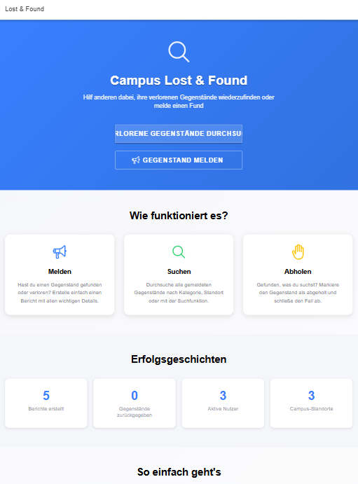
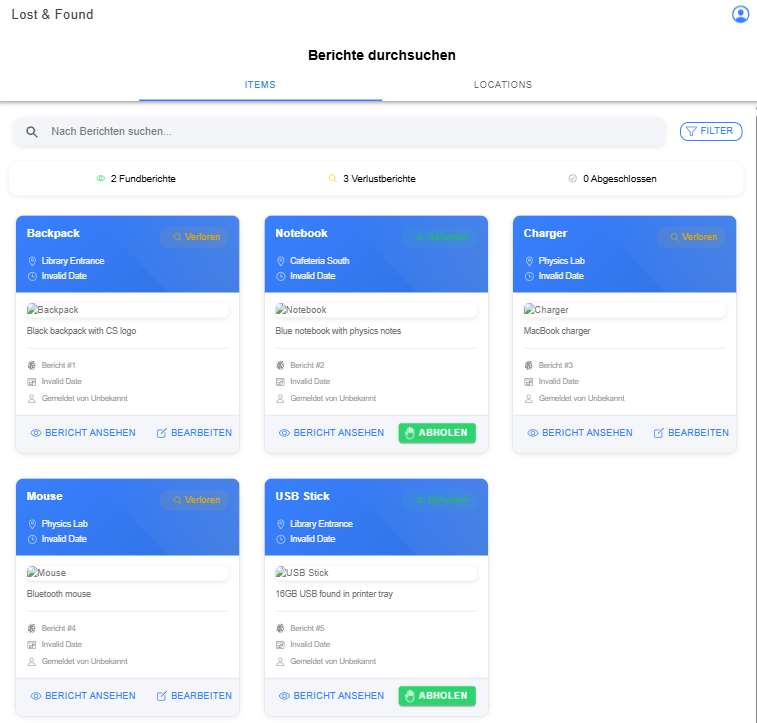
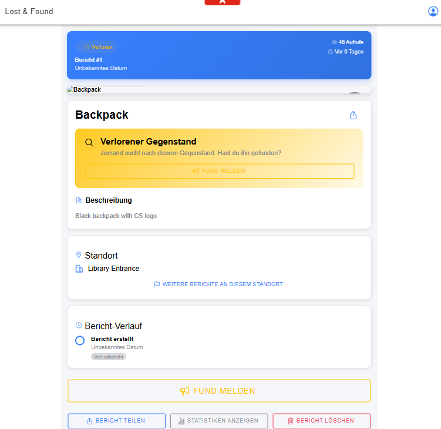
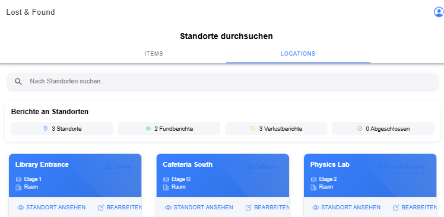
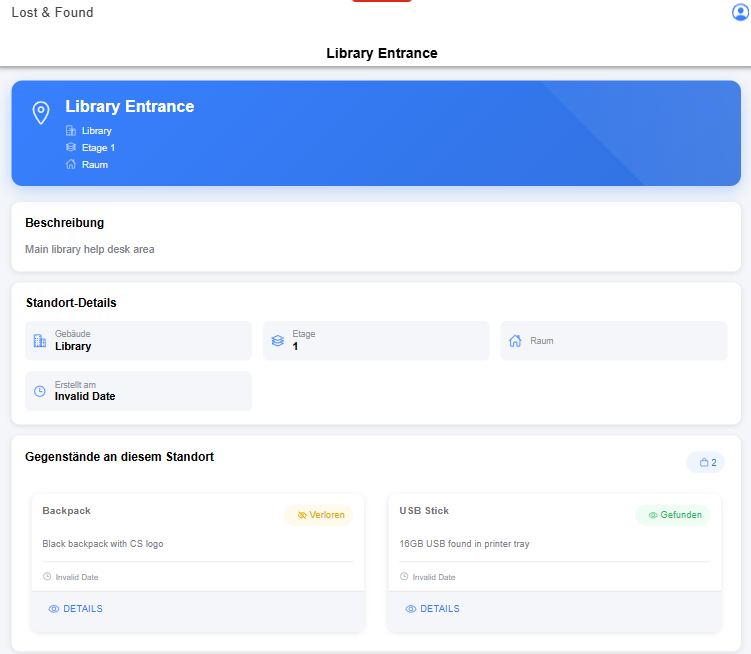

# 📌 Milestone 2 - Partial Implementation

## 👤 User Stories

### 🟦 User Story #1 – Static Info Page

**Story:**  
As an interested user, I want to receive general information about the Lost & Found app, so that I can decide whether or not it is useful.

**Screenshots:**  


### 🟩 User Story #2 – View All Items and Reports

**Story:**  
As a student looking for something I lost, I want to see all items and reports, so that I can find my lost item.

**Screenshots:**  
  


### 🟩 User Story #3 – View Locations and Reports

**Story:**  
As a student looking for an item I lost, I want to see all locations and reports, so that I can check if my item is there.

**Screenshots:**  
  


---

## ⚙️ Setup Instructions

### Prerequisites
- Docker installed
- Java for local backend (non-Docker)
- Node.js and npm for local frontend (non-Docker)

### Docker-based Setup (recommended)

#### 1. Create external Docker network (if not yet created)

```bash
make network
````

#### 2. Start infrastructure (MySQL + MinIO)

```bash
make infra
```
- This will start the MySQL and MinIO services in Docker containers. 
- You can check the database via a simple dashboard at `http://localhost:8082`.
  - server: `mysql`
  - username: `root`
  - password: `root`
  - database: `campus_lost_found`
- You can access the MinIO web interface at `http://localhost:9001` with username and password both `minioadmin`.

#### 3. Start backend with Docker

```bash
make backend-docker
```

Then you can access the Swagger UI at `http://localhost:8080/api/swagger-ui/index.html`.


#### 4. Start frontend with Docker

```bash
make frontend-docker
```

Then you can access the frontend at `http://localhost:3000`.

---

### 💻 Local Development (non-Docker)

> ⚠️ Make sure at least MySQL is running via Docker (`make infra`)

#### 1. Rename environment file in frontend

```bash
cp frontend/.env.example frontend/.env
```

#### 2. Run backend locally

```bash
make backend
```

#### 3. Run frontend locally

```bash
make frontend
```

---

### 🔄 Clean & Restart Infra (if needed)

```bash
make infra-restart # needed when backend is stopped due to persistent data of MySQL
```

---

## 📝 Some Remarks

- Some UI details are still missing, such as correct date display. This will be fixed soon.
- Images are not shown yet because we use dummy data (although saved in database). Once the backend is fully connected to MinIO, images will be displayed.
- There are some differences between the frontend and backend data models. We will align these in the next iteration based on feedback received from lecturer and recent changes.