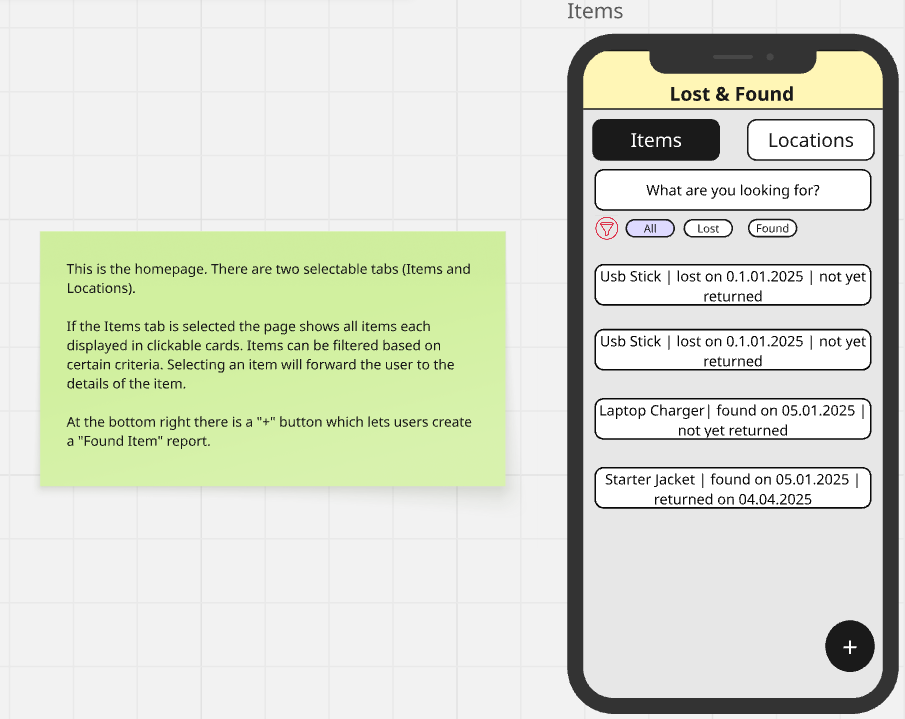
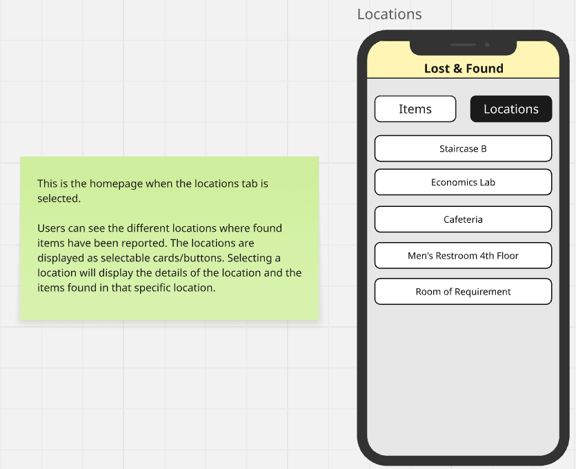
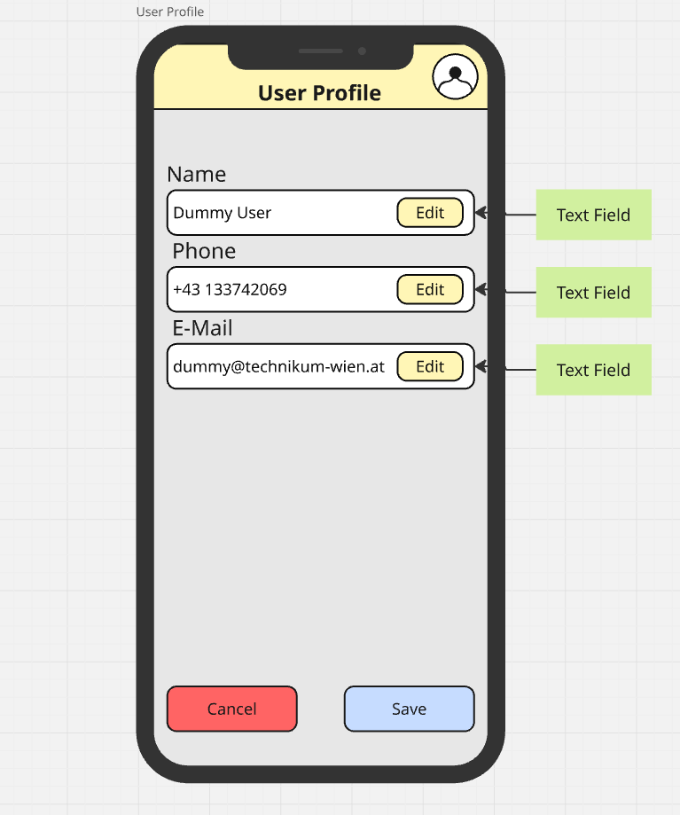
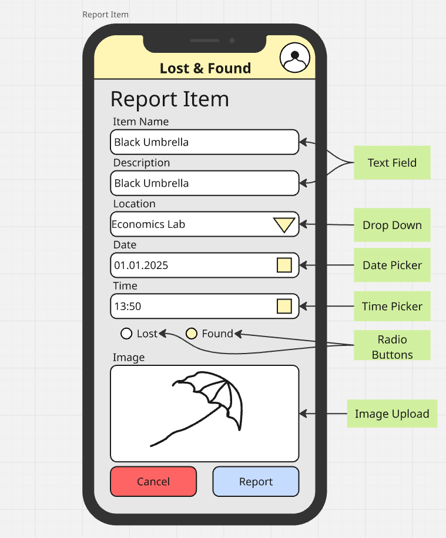
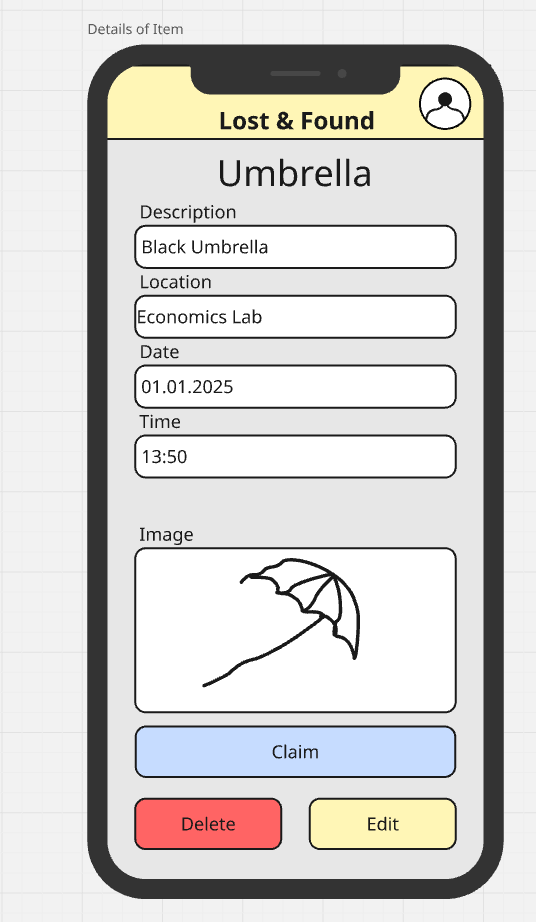
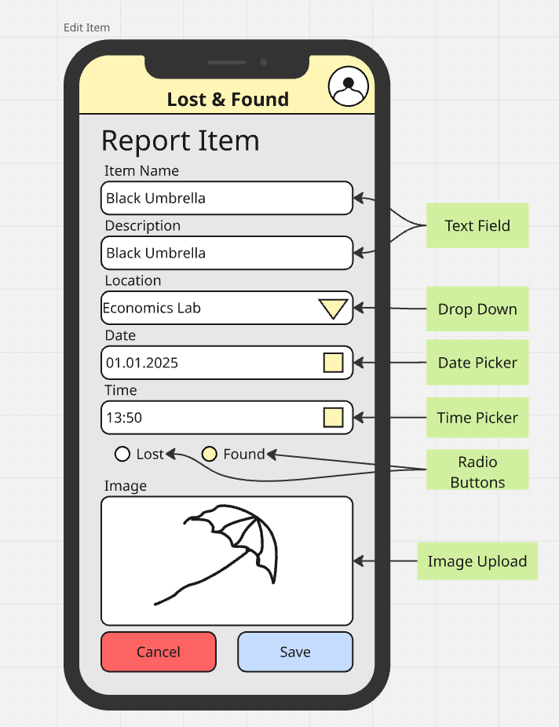
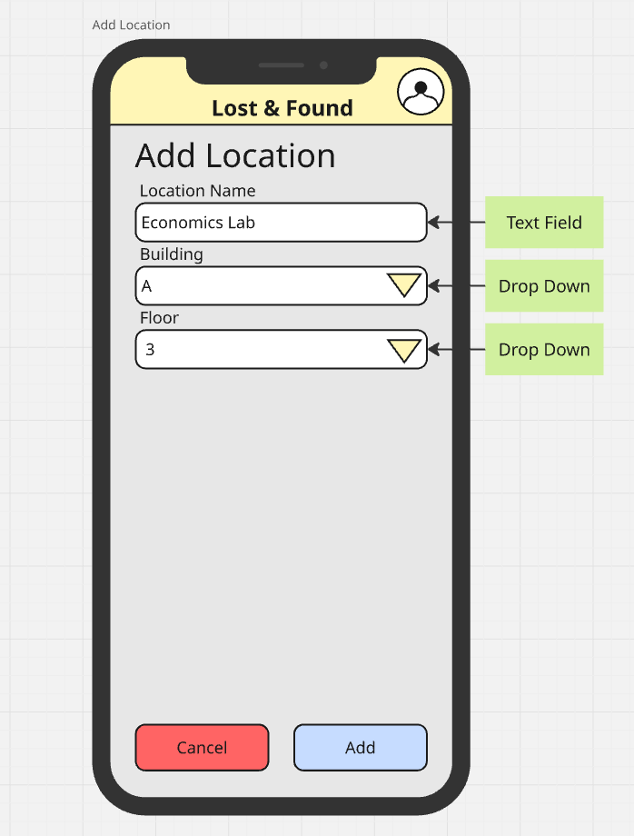
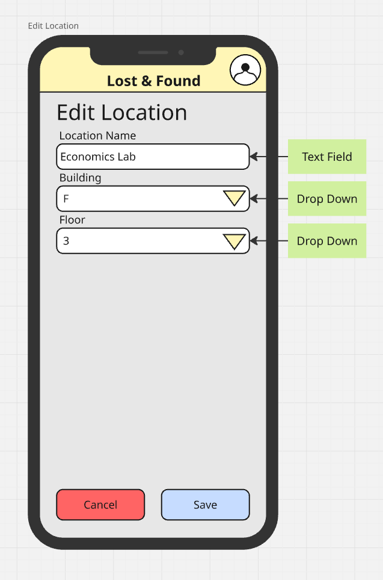

# 📱 Campus Lost & Found Service – Planning & Specification

The PDF versions of each deliverable can be found here:

- API Specification: [here](pdfs/API_Specification.pdf)
- DB Design: [here](pdfs/DB_Design.pdf)
- Paperprototype: [here](pdfs/Paperprototype.pdf)

## 🎯 Project Idea & Motivation

The Campus Lost & Found Service is a mobile-first full-stack application that helps people on our campus report and recover lost and found items.
Users (students, faculty, staff) can report items they've found, which creates visible entries for others to browse and retrieve their lost belongings.

### Motivation:

Misplaced belongings are a common issue on large campuses. This app simplifies and streamlines the process of reuniting people with their lost property by:

- Providing an intuitive interface for reporting found items.
- Offering a searchable list of found objects.
- Organizing items by location and category.

---

## 🧩 Resource Description

| Resource    | Description                                                | Relationships                                 |
| ----------- | ---------------------------------------------------------- | --------------------------------------------- |
| `items`     | Data about found objects (name, brand, color, photo, etc.) | Linked to one`location`, created via `report` |
| `reports`   | Submission of a found item by a user                       | Creates a new`item`, references `location`    |
| `locations` | Campus areas (e.g., library, cafeteria, lecture hall)      | Can have many`items`                          |
| `users`     | Session-based users who submit reports                     | Can create multiple`reports`                  |

---

## 👤 User Stories

### 🟦 User Story #1 – Static Info Page

**Story:**
As an interested user, I want to receive general information about the Lost & Found app, so that I can decide whether or not it is useful.

**Affected/Related Resources:**
_(none)_

**Planned Implementation:**
Static homepage with an overview of functionality, benefits, and how to contribute.

---

### 🟩 User Story #2 – View All Items and Reports

**Story:**
As a student looking for something I lost, I want to see all items and reports, so that I can find my lost item.

**Affected/Related Resources:**
`items`, `reports`, `locations`, `users`

**Planned Implementation:**

- List view with filters and search
  + `GET /items`
- Item detail view
  + `GET /items/:id`
- Report detail view (includes item, location and user data)
  + `GET /reports/:id`

---

### 🟩 User Story #3 – View Locations and Reports

**Story:**
As a student looking for an item I lost, I want to see all locations and reports, so that I can check if my item is there.

**Affected/Related Resources:**
`locations`, `items`, `reports`, `users`

**Planned Implementation:**

- List view of all locations
  + `GET /locations`
- Location detail view listing related items
  + `GET /locations/:id/items`
- Report detail view (includes item, location and user data)
  + `GET /reports/:id`

---

### 🟥 User Story #4 – Report Item

**Story:**
As a student or teacher who has found one or more items, I want to manage reports, so that the owners of the items can retrieve it.

**Affected/Related Resources:**
`reports`, `items`, `locations`, `users`

**Planned Implementation:**

- Form to enter item details and pick location
  + `POST /reports` (create item(s), location if needed)
- Form to edit report details
  + `PUT /reports/:id`
- Button to delete report
  + `DELETE /reports/:id`
- Form to edit item details
  + `PUT /items/:id`
- Button to delete item
  + `DELETE /items/:id`

---

### 🟥 User Story #5 – Claim Item

**Story:**
As a user who has found their lost item in the app, I want to update the details of the item, so that the report can be closed and the item marked as claimed.

**Affected Resources:**
`reports`, `items`, `users`

**Planned Implementation:**

- Edit report data
  + `PUT /reports/:id`
- Edit item data (includes marking as claimed)
  + `PUT /items/:id`

---

### 🟥 User Story #6 – Manage Locations

**Story:**
As a user who has found an item, I want to manage locations, so that I can add new locations or edit existing ones.

**Affected Resources:**
`locations`

**Planned Implementation:**

- Form to add new location
  + `POST /locations`
- Form to edit location details
  + `PUT /locations/:id`
- Button to delete location
  + `DELETE /locations/:id`

---

## 🧪 REST API Specification

You can find the REST API specification [here](pdfs/API_Specification.pdf). To create the PDF, we use this [HTML file](pdfs/API_Specification.html) and save it as a PDF.

### Assumptions & Decisions

- We decided to not implement endpoints that have no clear use case or are not needed for the MVP. Due to this some resources do not have all CRUD operations (i.e `users`).
- When a user wants to view a detailed report, we will return the item and location data as well. This is to avoid multiple requests to the server and to provide a more complete view of the report.

---

## 🖼️ Mobile Paper Prototypes

> **_NOTE:_** The PDF documentation can be found [here](pdfs/Paperprototype.pdf).

The following are the key wireframes representing the core user interface of the app:

1. **Home (Items Tab)**
   Displays a searchable list of all found items. Users can search for items and select individual items to view more details.
   
2. **Home (Locations Tab)**
   Lists all predefined campus locations where items were found or lost. Users can search for locations and select individual locations to view more details.
   
3. **User Profile**
   Allows editing of User Data.
   
4. **Report Item**
   Allows reporting of lost or found items.
   
5. **Item Details**
   Displays item details and allows for deleting, editing and claiming the item.
   
6. **Edit Item**
   Allows for editing previously reported items.
   
7. **Add Location**
   Allows adding of new locations.
   
8. **Location Details**
   Displays location details and allows for deleting and editing the location.
   
9. **Edit Location**
   Allows for editing previously added locations.
   

---

## 🗃️ Database Model (ER Diagram)

[ER Diagram](pdfs/DB_Design.pdf)

---
