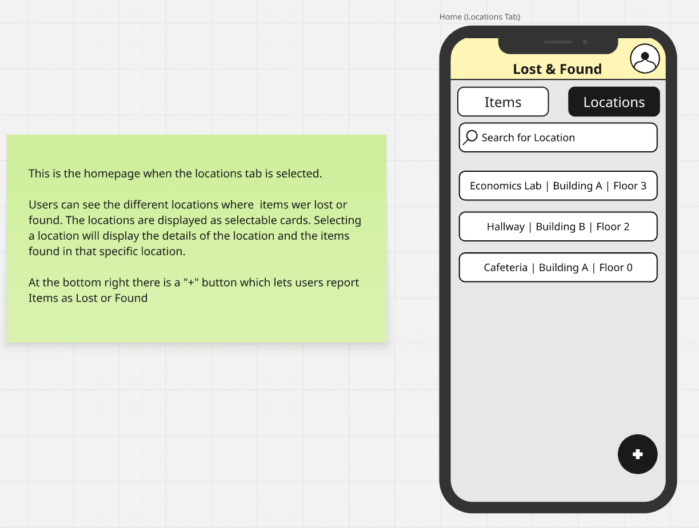

# 📱 Campus Lost & Found Service – Planning & Specification

The PDF versions of each deliverable can be found here:

- API Specification: [here](pdfs/API_Specification.pdf)
- DB Design: [here](pdfs/DB_Design.pdf)
- Paperprototype: [here](pdfs/Paperprototype.pdf)

## 🎯 Project Idea & Motivation

The Campus Lost & Found Service is a mobile-first full-stack application that helps people on our campus report and recover lost and found items.
Users (students, faculty, staff) can report items they've found, which creates visible entries for others to browse and retrieve their lost belongings.

### Motivation:

Misplaced belongings are a common issue on large campuses. This app simplifies and streamlines the process of reuniting people with their lost property by:

- Providing an intuitive interface for reporting found items.
- Offering a searchable list of found objects.
- Organizing items by location and category.

---

## 🧩 Resource Description

| Resource    | Description                                                | Relationships                                 |
| ------------- | ------------------------------------------------------------ | ----------------------------------------------- |
| `items`     | Data about found objects (name, brand, color, photo, etc.) | Linked to one`location`, created via `report` |
| `reports`   | Submission of a found item by a user                       | Creates a new`item`, references `location`    |
| `locations` | Campus areas (e.g., library, cafeteria, lecture hall)      | Can have many`items`                          |
| `users`     | Session-based users who submit reports                     | Can create multiple`reports`                  |

---

## 👤 User Stories

### 🟦 User Story #1 – Static Info Page

**Story:**
As an interested user, I want to receive general information about the Lost & Found app, so that I can decide whether or not it is useful.

**Affected Resources:**
*(none)*

**Planned Implementation:**
Static homepage with an overview of functionality, benefits, and how to contribute.

---

### 🟩 User Story #2 – View All Found Items

**Story:**
As a student looking for something I lost, I want to see all found items, so that I can find my lost item.

**Affected Resources:**
`items`

**Planned Implementation:**

- List view with filters and search
- `GET /items`

---

### 🟩 User Story #3 – View Items by Location

**Story:**
As a student looking for an item I lost, I want to see all items found in a specific location, so that I can check if my item is there.

**Affected Resources:**
`locations`, `items`

**Planned Implementation:**

- Location detail view listing related items
- `GET /locations/:id/items`

---

### 🟥 User Story #4 – Report a Found Item

**Story:**
As a student or teacher who has found a missing item, I want to submit a report, so that the owner of the item can retrieve it.

**Affected Resources:**
`reports`, `items`, `locations`

**Planned Implementation:**

- Form to enter item details and pick location
- `POST /reports` (creates item, location if needed)

---

### 🟥 User Story #5 – Update Report Details

**Story:**
As a user who has submitted a found item report, I want to update the details of the report, so that it accurately describes the item and its location.

**Affected Resources:**
`reports`, `items`

**Planned Implementation:**

- Edit report and associated item data
- `PUT /reports/:id`
- `PUT /items/:id`

---

### 🟥 User Story #6 – Delete a Report

**Story:**
As a user who has retrieved their missing item, I want to delete the report, so that others can no longer see it.

**Affected Resources:**
`reports`, `items`

**Planned Implementation:**

- Confirm deletion
- `DELETE /reports/:id`
- `DELETE /items/:id`

---

## 🧪 REST API Specification

### **CREATE**

- `POST /users` – Create user session
- `POST /reports` – Submit a found item report
- `POST /items` – (Indirectly created via report)
- `POST /locations` – Add a new campus location

---

### **READ**

- `GET /users/:id/reports` – View all reports by a user
- `GET /items` – View all found items
- `GET /items/:id` – View a specific found item
- `GET /locations` – View all locations
- `GET /locations/:id/items` – View items in one location

---

### **UPDATE**

- `PUT /reports/:id` – Update report
- `PUT /items/:id` – Update item data
- `PUT /locations/:id` – Edit location details

---

### **DELETE**

- `DELETE /reports/:id` – Delete a report
- `DELETE /items/:id` – Delete item entry
- `DELETE /locations/:id` – Remove a location

---

## 🖼️ Mobile Paper Prototypes

The following are the key wireframes representing the core user interface of the app:

1. **Home (Items Tab)**
   Displays a searchable list of all found items. Users can filter by "All", "Lost", or "Found", and select individual items to view more details.
   
2. **Home (Locations Tab)**
   Lists all predefined campus locations where items were found. Each location can be selected to view associated items.
   
3. **Report Found Item Form**
   Form for reporting a found item, including fields for name, description, location (dropdown), date, time, and image upload.
   
4. **Location Detail Page**
   Shows all items found at a specific location, listed by name and found date.
   
5. **Item Detail Page**
   Displays full item details: brand, color, location, image, and includes action buttons like "Claim".
   

---

## 🗃️ Database Model (ER Diagram)

📌 *To be added later.*

---
